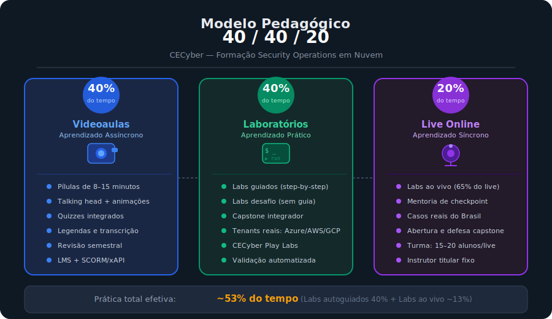
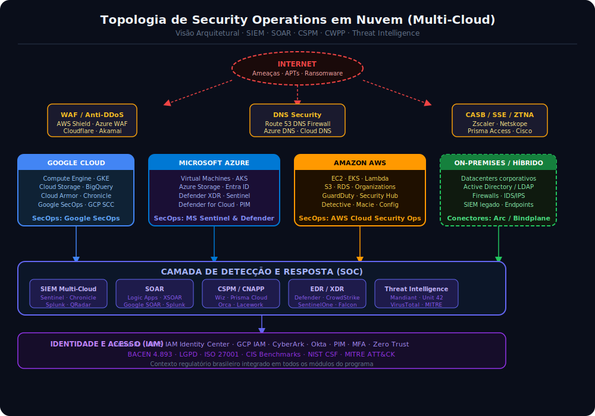
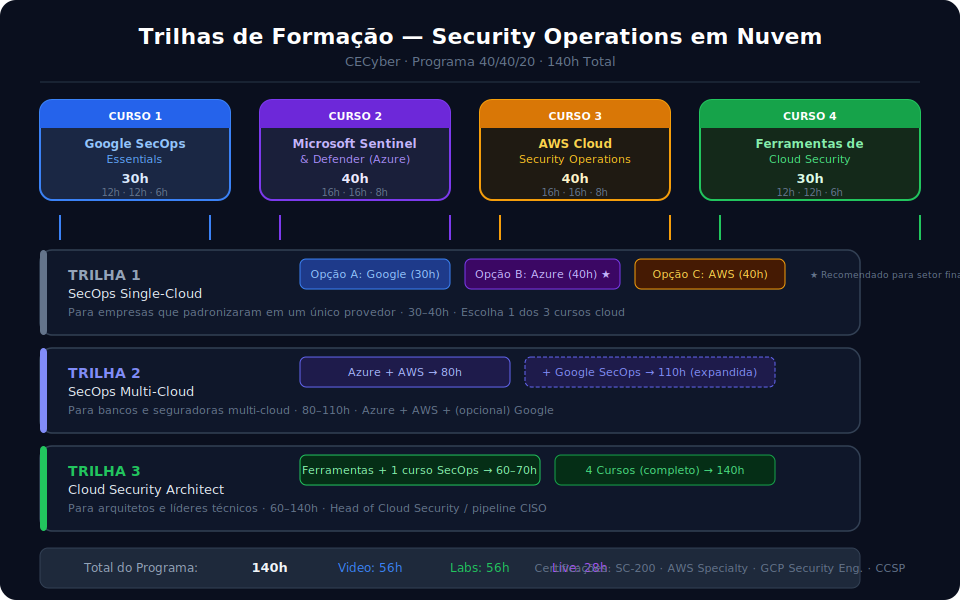

# Programa de Formação: Security Operations em Nuvem

**CECyber — Educação Corporativa em Cibersegurança**

[](#cursos)
[](#panorama-dos-cursos)
[](#modelo-pedagógico-404020)
[](#)
[](#)

---

## Apresentação

Este repositório reúne o **material completo** do Programa de Formação em Security Operations em Nuvem da CECyber — um conjunto de quatro cursos livres corporativos destinados a profissionais de TI, Cloud Computing e Segurança Cibernética que atuam ou buscam atuar em operações de segurança em ambientes de nuvem.

O programa foi desenvolvido com base nas referências mais atuais de mercado — incluindo publicações do Gartner, NIST, CIS, MITRE, AWS, Microsoft, Google, Palo Alto Networks (Unit 42), CrowdStrike, Mandiant e líderes globais como Bruce Schneier, Jen Easterly, Anton Chuvakin e Mikko Hyppönen — e está contextualizado à realidade regulatória brasileira (BACEN 4.893, LGPD, Marco Civil).

---

## Modelo Pedagógico 40/40/20



O programa adota um modelo híbrido fundamentado em **três pilares complementares**:

| Pilar                          | Proporção | Formato                                                                    |
|:-------------------------------|:---------:|:---------------------------------------------------------------------------|
| **Videoaulas** (Assíncrono)    |    40%    | Pílulas de 8–15 min, animações, quizzes integrados, LMS com SCORM/xAPI    |
| **Laboratórios** (Prática)     |    40%    | Hands-on em tenants reais (Azure/AWS/GCP) + CECyber Play Labs              |
| **Live Online** (Síncrono)     |    20%    | Labs ao vivo com instrutor sênior, mentorias, casos reais do Brasil        |

> **Impacto prático:** somando laboratórios autoguiados (40%) com laboratórios ao vivo conduzidos
> pelo instrutor durante as lives (~13% do tempo total), o aluno dedica aproximadamente **53%
> do programa à prática efetiva em ambiente real de nuvem**.

---

## Panorama dos Cursos

| Nº  | Curso                                                 |  CH  | Vídeo | Lab  | Live | Certificação Alvo                              |
|:---:|:------------------------------------------------------|:----:|:-----:|:----:|:----:|:-----------------------------------------------|
|  1  | [Google SecOps Essentials][c1]                        | 30h  |  12h  | 12h  |  6h  | Google Cloud Professional Security Engineer     |
|  2  | [Microsoft Sentinel & Defender: SecOps no Azure][c2]  | 40h  |  16h  | 16h  |  8h  | Microsoft SC-200                                |
|  3  | [AWS Cloud Security Operations][c3]                   | 40h  |  16h  | 16h  |  8h  | AWS Certified Security – Specialty (SCS-C02)    |
|  4  | [Ferramentas de Cloud Security: CNAPP, IaC e DevSecOps][c4] | 30h | 12h | 12h | 6h | CCSP (ISC²) / CCSK (CSA)                  |
|     | **Total do Programa**                                 | **140h** | **56h** | **56h** | **28h** | **4 certificações internacionais**  |

[c1]: ./curso-01-google-secops/README.md
[c2]: ./curso-02-azure-secops/README.md
[c3]: ./curso-03-aws-secops/README.md
[c4]: ./curso-04-cloud-security-tools/README.md

---

## Topologia de Security Operations em Nuvem

O diagrama abaixo representa a **visão arquitetural completa** do ambiente de Cloud SecOps abordado no programa — desde a camada de proteção de borda até o SOC multi-cloud, cobrindo todos os provedores de nuvem trabalhados nos cursos.



---

## Trilhas de Formação



Os quatro cursos podem ser cursados isoladamente ou combinados em trilhas temáticas conforme o
perfil e os objetivos do profissional ou da organização:

### Trilha 1 — SecOps Single-Cloud (30h a 40h)
Para empresas que padronizaram em um único provedor de nuvem. Escolha **uma** das opções:
- **Opção A:** Google SecOps Essentials (30h)
- **Opção B:** Microsoft Sentinel & Defender (40h) ⭐ *Recomendado para o setor financeiro brasileiro*
- **Opção C:** AWS Cloud Security Operations (40h)

### Trilha 2 — SecOps Multi-Cloud (80h a 110h)
Para organizações que operam em múltiplos provedores de nuvem — comum em grandes bancos,
seguradoras e grupos financeiros brasileiros:
- Azure SecOps (40h) + AWS SecOps (40h) → **80h**
- Expandida com Google SecOps Essentials (30h) → **110h**

### Trilha 3 — Cloud Security Architect (60h a 140h)
Para arquitetos e líderes técnicos responsáveis por estratégia, ferramental e governança:
- Ferramentas de Cloud Security (30h) + 1 curso SecOps → **60–70h**
- Trilha completa (4 cursos) → **140h** *(pipeline de Head of Cloud Security e futuros CISOs)*

---

## Público-Alvo

```
┌─────────────────────────────────────────────────────────────────────────┐
│                    PÚBLICO-ALVO DO PROGRAMA                             │
├────────────────────┬────────────────────────────────────────────────────┤
│ Profissionais de   │ Admins de sistemas, engenheiros de infra, suporte   │
│ TI                 │ N2/N3, service desk, transição para Cloud Security  │
├────────────────────┼────────────────────────────────────────────────────┤
│ Profissionais de   │ Cloud engineers, arquitetos de nuvem, DevOps,       │
│ Cloud              │ SRE, Platform Engineers                             │
├────────────────────┼────────────────────────────────────────────────────┤
│ Profissionais de   │ Analistas de SOC (L1, L2, L3), threat hunters,      │
│ Cibersegurança     │ incident responders, analistas de vuln, GRC cloud   │
├────────────────────┼────────────────────────────────────────────────────┤
│ Líderes Técnicos   │ Coordenadores, tech leads, arquitetos, gestores     │
│                    │ que avaliam ou auditam stacks de SecOps em nuvem    │
└────────────────────┴────────────────────────────────────────────────────┘
```

### Pré-requisitos Gerais

- Formação técnica em TI, Cloud ou Segurança (CompTIA Security+, Network+, Cloud+ ou equivalente)
- Experiência prática com pelo menos um provedor de nuvem **OU** certificações foundational:
  AWS Cloud Practitioner (CLF-C02), AZ-900 ou Google Cloud Digital Leader
- Familiaridade com conceitos de logs, redes TCP/IP e linha de comando (bash / PowerShell)
- Noções de MITRE ATT&CK *(apresentadas nos módulos introdutórios quando necessário)*

---

## Mapa de Certificações Internacionais

O programa prepara para as principais certificações de segurança em nuvem reconhecidas pelo mercado global:

```
MITRE ATT&CK ──────────────────────────────────────────────────────────────────
  (base de todas as detecções, caçadas e exercícios do programa)

Curso 1: Google SecOps ──────────────────────────────────────────────────────
  └── Google Cloud Professional Cloud Security Engineer
  └── (Suporte): CompTIA CySA+

Curso 2: Azure SecOps ───────────────────────────────────────────────────────
  └── Microsoft SC-200 (Security Operations Analyst Associate) ← preparação direta
  └── (Suporte): CompTIA CySA+ · AZ-500 · MS-500

Curso 3: AWS SecOps ─────────────────────────────────────────────────────────
  └── AWS Certified Security – Specialty (SCS-C02) ← preparação direta
  └── (Suporte): CompTIA CySA+ · CompTIA CASP+

Curso 4: Cloud Security Tools ───────────────────────────────────────────────
  └── CCSP (ISC²) — Cloud Security Professional
  └── CCSK (CSA) — Certificate of Cloud Security Knowledge
  └── CISSP (ISC²) — domínio de Cloud Security
  └── (Suporte): CompTIA CASP+ · Wiz Certified · Palo Alto PCCSE

Programa Completo ───────────────────────────────────────────────────────────
  └── Cobertura abrangente para EC-Council: CEH · CHFI · CTIA (cenários cloud)
  └── Articulação com CompTIA: CySA+ e CASP+ (parceria CECyber)
```

Para o mapeamento detalhado de cada módulo com os capítulos dos programas oficiais de certificação,
consulte: [docs/mapa-certificacoes.md](docs/mapa-certificacoes.md)

---

## Diferenciais Pedagógicos CECyber

```
┌──────────────────────────────────────────────────────────────────────────────┐
│  CECyber Play Labs ·  Plataforma proprietária de laboratórios hands-on e     │
│  simulações operacionais com cenários vivos de blue team, red team e purple  │
│  team — aderentes ao mercado financeiro regulado brasileiro.                 │
├──────────────────────────────────────────────────────────────────────────────┤
│  MITRE ATT&CK ·  Toda detecção, caçada e exercício é ancorada em táticas    │
│  e técnicas do framework global. Matriz de cobertura por módulo disponível.  │
├──────────────────────────────────────────────────────────────────────────────┤
│  Contexto Brasil ·  Integração com BACEN 4.893, CMN 4.658, LGPD, Marco      │
│  Civil, SUSEP e ANPD. Cenários de capstone baseados em casos do setor        │
│  financeiro regulado brasileiro.                                              │
├──────────────────────────────────────────────────────────────────────────────┤
│  Trilha de Certificação ·  Cada curso prepara para uma certificação de       │
│  mercado reconhecida. Simulados incluídos nos cursos de 40h.                 │
├──────────────────────────────────────────────────────────────────────────────┤
│  Instrutores Seniores ·  Profissionais com atuação atual em SOCs             │
│  corporativos e advisory de CISOs, não apenas carreira acadêmica.            │
└──────────────────────────────────────────────────────────────────────────────┘
```

---

## Especialistas de Referência

O programa foi construído a partir das publicações e insights dos principais especialistas mundiais
em cibersegurança e cloud security:

| Especialista               | Área de Referência                                    | Contribuição ao Programa                          |
|:---------------------------|:------------------------------------------------------|:--------------------------------------------------|
| **Bruce Schneier**         | Criptografia, política de segurança, teoria do risco  | Fundamentos de segurança e modelo de confiança    |
| **Brian Krebs**            | Jornalismo investigativo em cibersegurança            | Casos reais de incidentes e análise de ameaças    |
| **Mikko Hyppönen**         | Malware, APTs, inteligência de ameaças                | Contexto de threat landscape global               |
| **Troy Hunt**              | Breaches, identidade, HIBP                            | Gestão de exposição de credenciais                |
| **Jen Easterly**           | Governança de cibersegurança nacional (ex-CISA)       | Política e regulação de segurança                 |
| **Katie Moussouris**       | Vulnerability disclosure, bug bounty                  | Gestão de vulnerabilidades e divulgação           |
| **Anton Chuvakin**         | SIEM, SOC, detecção (Google Cloud / Gartner)          | Arquitetura de SIEM e operações de SOC            |
| **Keren Elezari**          | Hacking ético, diversidade em cyber                   | Cultura de segurança e ética profissional         |
| **Daniel Miessler**        | Threat modeling, SecOps, frameworks                   | Frameworks e modelos de maturidade                |
| **Lesley Carhart**         | ICS/OT Security, incident response                    | Resposta a incidentes e forense                   |
| **Nicole Perlroth**        | Jornalismo de cibersegurança e espionagem             | Contexto geopolítico e casos reais                |
| **David Kennedy**          | Red team, OSINT, penetration testing                  | Perspectiva ofensiva para detecção defensiva      |
| **Eric Cole**              | Network security, SOC, cyber defense                  | Arquitetura de defesa e operações de SOC          |
| **Richard Stiennon**       | Análise de mercado de segurança (IT-Harvest)          | Panorama de vendors e ferramentas                 |
| **Chuck Brooks**           | Tendências, regulação, IA em segurança                | Futuro da cibersegurança e IA                     |

---

## Fontes e Referências de Mercado

### Relatórios e Pesquisas Fundamentais

| Fonte                        | Publicação Referenciada                                                        |
|:-----------------------------|:-------------------------------------------------------------------------------|
| **Gartner**                  | Magic Quadrant for SIEM · Hype Cycle for Cloud Security · Innovation Insight for CNAPP |
| **Unit 42 (Palo Alto)**      | Cloud Threat Report · Incident Response Report · Ransomware Retrospective      |
| **CrowdStrike**              | Global Threat Report · Adversary Intelligence Playbook                         |
| **Mandiant (Google Cloud)**  | M-Trends Report · Advanced Persistent Threats · Red Team Methodologies         |
| **IBM Security**             | Cost of a Data Breach Report · X-Force Threat Intelligence Index               |
| **Microsoft**                | Digital Defense Report · Sentinel Documentation · MCRA                         |
| **Amazon AWS**               | Security Documentation · Well-Architected Framework Security Pillar            |
| **Google Cloud**             | SecOps Documentation · Chronicle Architecture · BeyondCorp                    |
| **WEF**                      | Global Cybersecurity Outlook · Cyber Resilience Principles                     |
| **CERT.BR / ANPD**          | Relatórios de incidentes · Cartilhas de segurança · Guias regulatórios         |
| **Fortinet**                 | FortiGuard Labs Threat Landscape Report                                         |
| **Zscaler**                  | ThreatLabz State of Ransomware Report · Zero Trust Exchange Architecture        |
| **SentinelOne**              | SentinelLabs Threat Research · Purple AI Documentation                         |
| **Tenable**                  | Cyber Exposure Report · Vulnerability Management Best Practices                |
| **Rapid7**                   | Under the Hoodie Report · Cloud Security Posture Research                       |
| **Splunk (Cisco)**           | State of Security Report · SIEM Architecture Guide                             |

---

## Contexto Regulatório Brasileiro

O programa contempla as principais normas e regulamentações que impactam a segurança em nuvem
no Brasil — especialmente no setor financeiro regulado:

| Norma / Regulamento          | Emissor   | Impacto para Cloud SecOps                                                  |
|:-----------------------------|:---------:|:---------------------------------------------------------------------------|
| **Resolução BACEN 4.893/2021** | BACEN   | Política de segurança cibernética para IFs; requisitos de logging e IR      |
| **Resolução CMN 4.658/2018**  | CMN      | Contratação de serviços em nuvem por IFs; due diligence de provedores       |
| **LGPD (Lei 13.709/2018)**    | ANPD     | Proteção de dados pessoais; notificação de incidentes                       |
| **Marco Civil da Internet**   | AGU      | Guarda de logs, neutralidade de rede, responsabilidade civil                |
| **Resolução SUSEP 4.553**     | SUSEP    | Segurança cibernética para seguradoras                                      |
| **ISO/IEC 27001:2022**        | ISO      | SGSI; controles de segurança; referência internacional                      |
| **Guia de Segurança em Nuvem ANPD** | ANPD | Tratamento de dados em provedores de nuvem                           |

Para detalhes, consulte: [docs/contexto-regulatorio-brasil.md](docs/contexto-regulatorio-brasil.md)

---

## Estrutura do Repositório

```
formacao-cloud-secops/
│
├── CLAUDE.md                                 ← Memória viva do projeto (consulte sempre)
├── README.md                                 ← Esta página
│
├── assets/
│   ├── diagramas/                            ← SVGs de arquitetura e topologia
│   ├── infograficos/                         ← Infográficos e visualizações
│   └── imagens/                              ← Imagens auxiliares
│
├── docs/
│   ├── modelo-pedagogico.md                  ← Detalhamento completo do modelo 40/40/20
│   ├── trilhas-formacao.md                   ← Trilhas Single-Cloud, Multi-Cloud, Architect
│   ├── mapa-certificacoes.md                 ← Módulo × capítulo de certificações
│   ├── referencias-especialistas.md          ← Especialistas e referências bibliográficas
│   └── contexto-regulatorio-brasil.md        ← BACEN, LGPD, Marco Civil, SUSEP, ANPD
│
├── curso-01-google-secops/
│   ├── README.md                             ← Ementa, objetivos e informações gerais
│   ├── modulos/
│   │   ├── modulo-00-ambiente-laboratorio/   ← Setup completo do ambiente (obrigatório)
│   │   ├── modulo-01-fundamentos/
│   │   ├── modulo-02-ingestao-udm/
│   │   ├── modulo-03-yara-l-detection/
│   │   ├── modulo-04-threat-hunting-ueba/
│   │   ├── modulo-05-threat-intelligence/
│   │   ├── modulo-06-soar-playbooks/
│   │   └── modulo-07-capstone/
│   └── laboratorios/
│       ├── lab-01-parser-cbn/
│       ├── lab-02-yara-l-multi-event/
│       ├── lab-03-hunting-c2-beaconing/
│       ├── lab-04-playbook-soar-phishing/
│       └── lab-05-capstone/
│
├── curso-02-azure-secops/                    ← (mesma estrutura)
├── curso-03-aws-secops/                      ← (mesma estrutura)
└── curso-04-cloud-security-tools/            ← (mesma estrutura)
```

---

## Avaliação e Certificação

### Critérios de Aprovação

| Componente                           | Cursos 30h | Cursos 40h |
|:-------------------------------------|:----------:|:----------:|
| Quizzes integrados às videoaulas     |    20%     |    15%     |
| Laboratórios guiados e desafios      |    40%     |    35%     |
| Participação em lives e mentorias    |    10%     |    —       |
| Projeto individual / simulado        |    —       |    35%     |
| Capstone no CECyber Play Labs        |    30%     |    15%     |
| **Nota mínima para aprovação**       |  **70%**   |  **70%**   |

### Certificado Digital

O certificado digital emitido pela CECyber ao término de cada curso inclui:
- Carga horária discriminada por modalidade (vídeo, lab, live)
- Competências técnicas declaradas (lista de skills cobertas)
- Indicação de preparação para a certificação internacional alinhada
- QR Code de validação digital

---

## Como Usar Este Repositório

### Para Instrutores

1. Acesse o diretório do curso que irá ministrar
2. Leia o `README.md` do curso para visão geral
3. Para cada módulo, utilize o **roteiro de gravação em primeira pessoa** como script de aula
4. Siga os laboratórios na sequência indicada — cada lab depende do ambiente do módulo 00
5. Os gabaritos estão disponíveis em cada pasta de laboratório (acesso restrito a instrutores)

### Para Alunos

1. Comece pelo `modulo-00` do seu curso para configurar o ambiente
2. Assista às videoaulas antes de executar os laboratórios
3. Execute cada laboratório com o ambiente configurado conforme o módulo 00
4. Em caso de dúvidas nos labs, consulte o gabarito **apenas após** tentar resolver por conta própria
5. Registre suas descobertas e notas no diário de bordo (sugerido no LMS)

### Para Gestores e Líderes

1. Consulte [docs/trilhas-formacao.md](docs/trilhas-formacao.md) para escolher a trilha mais adequada ao perfil da equipe
2. Consulte [docs/mapa-certificacoes.md](docs/mapa-certificacoes.md) para alinhar com metas de certificação corporativa
3. Consulte [docs/contexto-regulatorio-brasil.md](docs/contexto-regulatorio-brasil.md) para requisitos de compliance e BACEN

---

## Licença e Uso

© 2026 CECyber — Educação Corporativa em Cibersegurança. Todos os direitos reservados.

Este material é de uso exclusivo para fins educacionais no contexto do programa de formação CECyber.
Reprodução, distribuição ou uso comercial sem autorização expressa é proibida.

---

*Versão 2.0 — Abril de 2026*  
*Documento técnico-pedagógico elaborado pela equipe de Educação Corporativa da CECyber*
